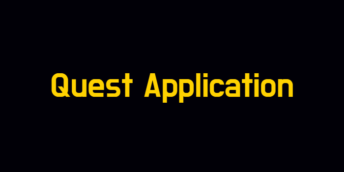
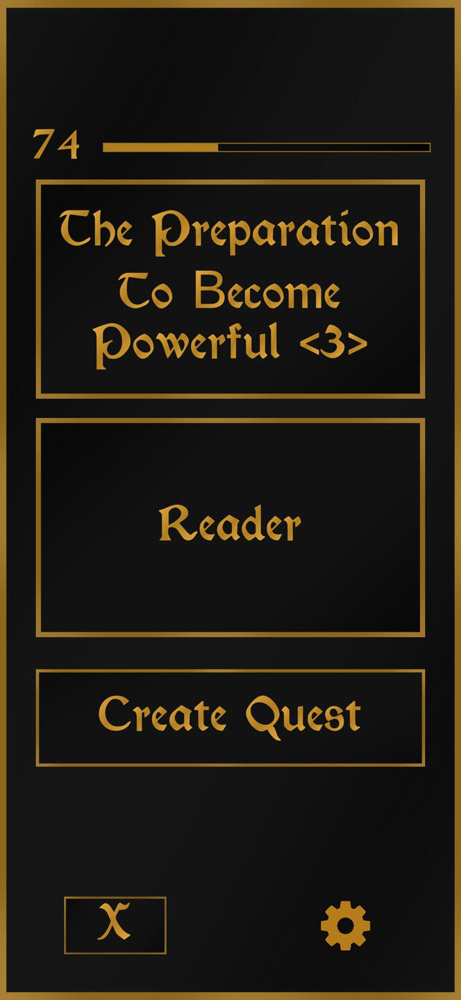
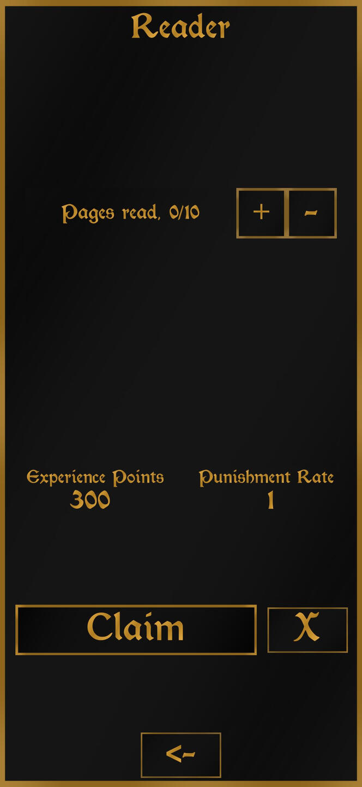
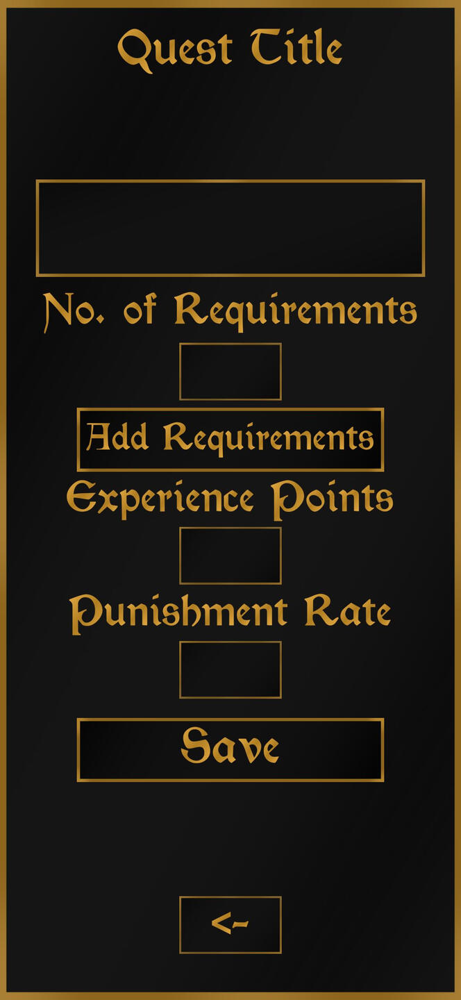
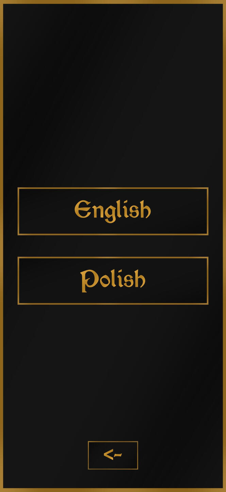

 
  

<h1 align="center"> Quest Application </h1>

 
  

<h2>About The Project</h2>

 
  This project is a mbile application/game inspired by Solo Leveling Player System. Made using Unity.

- Functionally, it works as a planner application
- Users can creates "Quests", daily tasks with certain requirements to finish
- Rewarding users for completing them, punishing them otherwise
- Quests have names, requirements, rewards and punishment rates
- There is also a hidden reward for over-completing the tasks
- Users have the ability to change language of the application from the provided list

<h2>Instalation</h2>

<h3>Unity Project</h3>

- Clone the repository into your local machine
- Install the required Unity version
- Open the project

<h3>Release</h3>

- Download the release version
- Move the .apk file to your mobile device
- Install the application
- Launch the application

<h2>Usage</h2>

- When the application is launched, users have access to the main window, where they can access language settings and create quests
- When creating quests, they can specify:
  1. Quest title
  2. Requirements, their number and contents
  3. Experience points
  4. Punishment rate
- After that, they will see added quests in the main window
- When choosing the quest from the list, users have an option to update the finished requirements and finish the quest, as well as to remove the quest

<h2>Gameplay Screenshots</h2>

  
  

  
  

